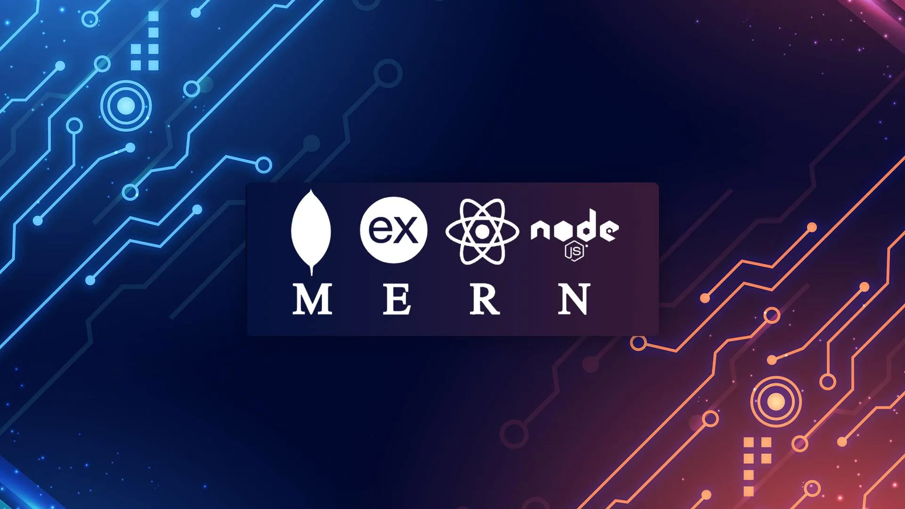

# Hi there 👋, I'm Sai Shivak Kumar
> <h3><i>A Civil Engineer Turned Full-Stack Developer 🚀</i><h3/>

## 🛠️ Skills
  
           

   

### 🌟 About Me  
- 📚 I recently completed a Fellowship in Software Development (Frontend Specialization) from Crio.Do, where I gained hands-on experience tackling real-world challenges.
- 🌟 Passionate about technology and problem-solving, I have transitioned from a background in sales quality analysis to immerse myself in software development.
- 🌱 Currently expanding my skill set by learning Back-End Development to further enhance my capabilities.
- 👯 I enjoy collaborating on scalable, impactful digital solutions that elevate user experiences.
- 🤝 Actively seeking a Front-End Developer role in a product-based company, whether it's an innovative startup or a renowned tech giant like FAANG. Let's connect if you're hiring or know of any opportunities!
- ⚡ Fun fact: I'm learning Japanese!
---

## 🚀 Let’s Build Something Great Together!  

Thank you for visiting my profile! If you’re looking for a dedicated Front-End Developer or simply want to collaborate on exciting projects, feel free to reach out.  

- 💌 **Email**: [sai9898karthik@gmail.com](mailto:sai9898karthik@gmail.com)  
- 💼 **LinkedIn**: [Sai Shivak Kumar](https://www.linkedin.com/in/sai-shivak-kumar-0209771bb)  
- 📂 **Portfolio**: [Explore My Work](https://www.crio.do/learn/portfolio/sai9898karthik/)  

I’m excited to connect and create impactful digital solutions. Let’s innovate together! 😊
