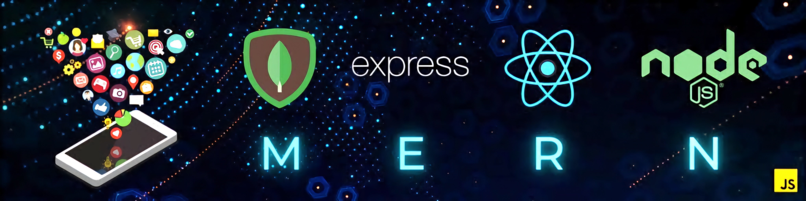
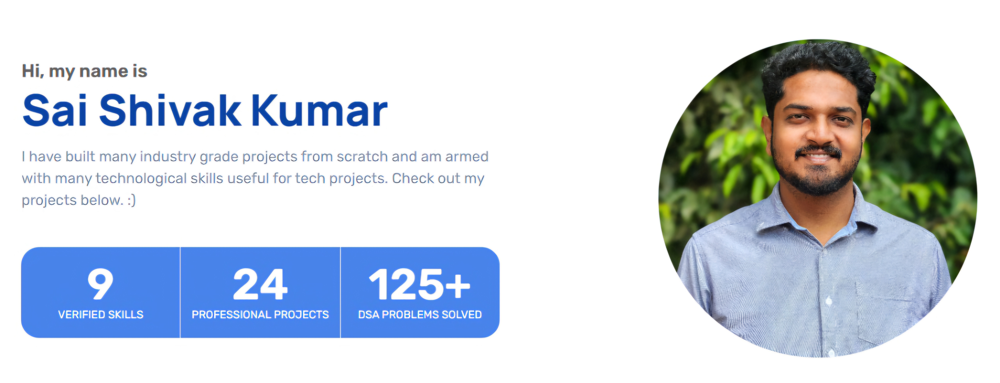

<h1 align="center"> Hi there 👋, I'm Sai Shivak Kumar </h1>
<h3 align="center"><i>A Civil Engineer Turned Full-Stack Developer 🚀</i><h3/>

 

<h2 align="center"> 🌟 About Me </h2>

 
 

- 📚 I have recently **completed a Front-End module** in a Fellowship program at Crio.Do, where I solved real-world development challenges.
- 🌟 I have transitioned from **sales quality analysis into software development**, driven by my passion for technology and problem-solving.
- 🌱 I’m currently expanding my skills by **learning Back-End Development** to grow as a Full-Stack Developer.
- 👯 I like collaborating on scalable digital solutions that improve user experiences.
- 🤝 I’m actively **seeking a Front-End Developer role** in product-based companies, whether they are innovative startups or renowned tech companies.
- ⚡ Fun fact: I'm learning Japanese!

 

<h2 align="center"> 🛠️ Skills </h2>

             
 

<h2 align="center"> 🌐 Portfolio </h2>

Visit my personal portfolio to explore my projects, skills, and experiences in detail!

  

<h2 align="center"> 🐙 GitHub Stats </h2>

  

---

<h2 align="center"> 🚀 Let’s Build Something Great Together! </h2>

Thank you for visiting my profile! If you’re looking for a dedicated Front-End Developer or simply want to collaborate on exciting projects, feel free to reach out.

  
  
  

I’m excited to connect and create impactful digital solutions. Let’s innovate together! 😊

