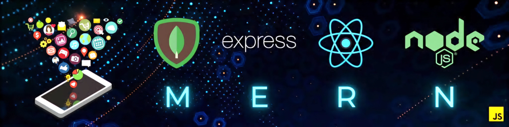
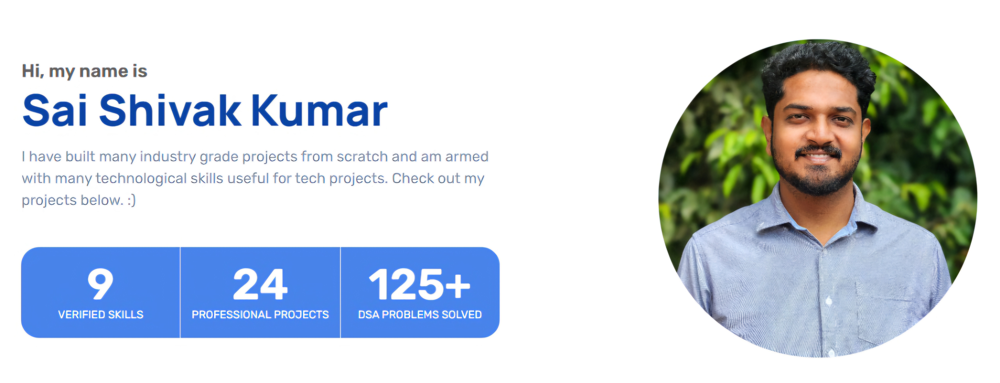

<h1 align="center"> Hi there 👋, I'm Sai Shivak Kumar </h1>
<h3 align="center"><i>Front-End Developer With an Eye for Detail 🚀</i></h3>

 

<h2 align="center"> 🌟 About Me </h2>

- 💻 **Experience**: I have hands-on experience **migrating a learning portal from vanilla JavaScript to React**, focusing on building reusable components, integrating APIs, and improving code maintainability within a small, cross-functional team.
- 🎓 **Certifications**: Certified through Crio.Do’s Fellowship Program, where I worked on projects like **Medify** and **Expense Tracker**.
- 🌱 **Passion**: I’m passionate about crafting clean, responsive UIs and solving real-world problems with modern web technologies.  
- 🧠 **Currently learning**: Node.js & Express (to grow into full-stack)  
- 🌍 **Exploring**: Open-source collaboration and scalable UI systems  
- 💼 **Actively seeking**: Front-End Developer roles at product-based companies  
- ⚡ **Fun fact**: I'm learning Japanese!  

 

<h2 align="center"> 🛠️ Skills </h2>

  
  
  
  
  
  
  
  
  
  
  
  
  
  
  
  

 

<h2 align="center"> 🌐 Portfolio </h2>

Explore my portfolio to see the projects, skills, and experiences I gained through the Crio.Do Fellowship Program!

  

 

---

<h2 align="center"> 🚀 Let’s Build Something Great Together! </h2>

Thanks for stopping by! Feel free to reach out if you're looking for a dedicated Front-End Developer or are interested in collaborating on exciting projects.

  
  
  

 

I’m excited to connect and create impactful digital solutions. Let’s innovate together! 😊

